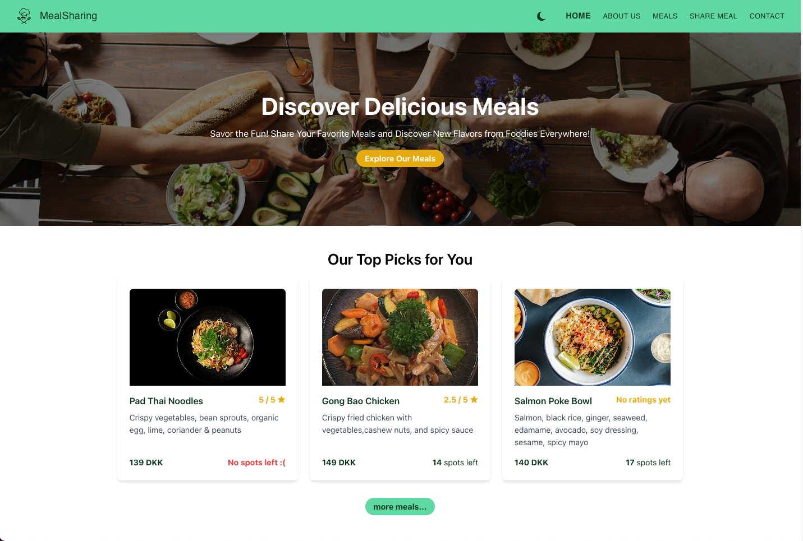
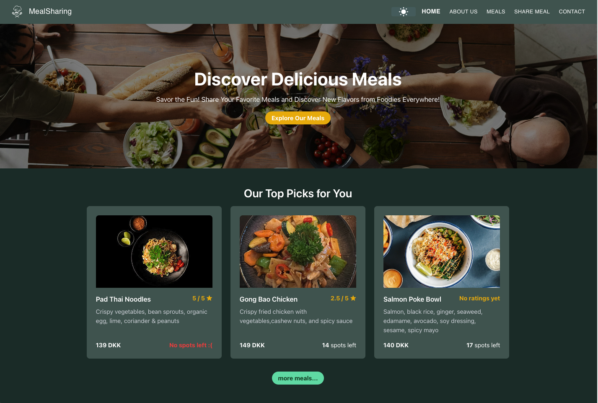
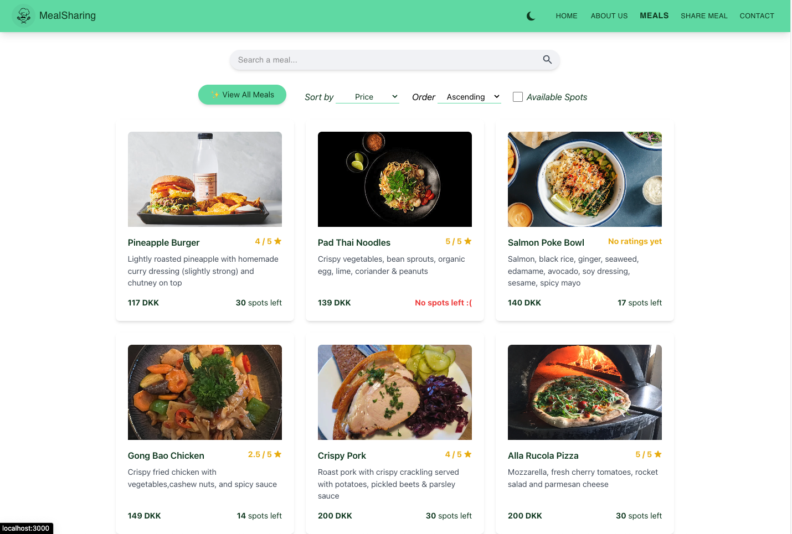
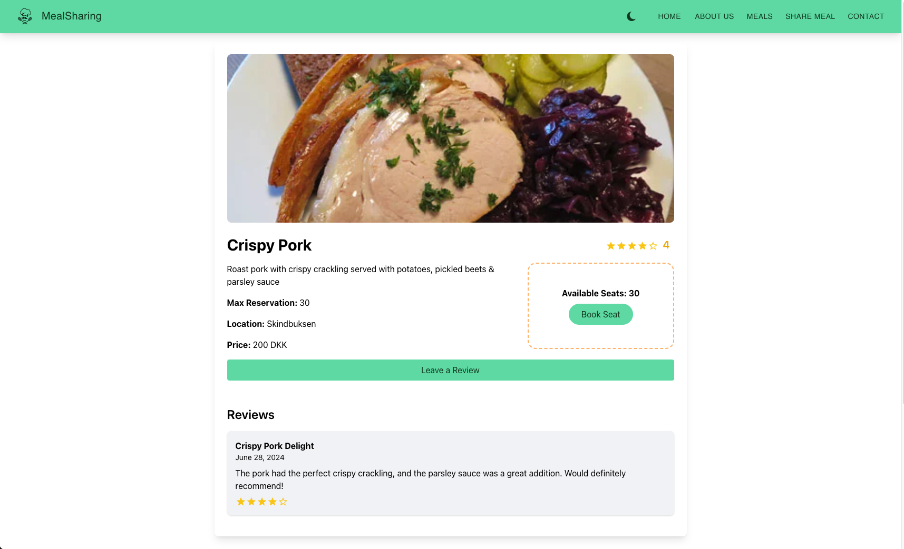
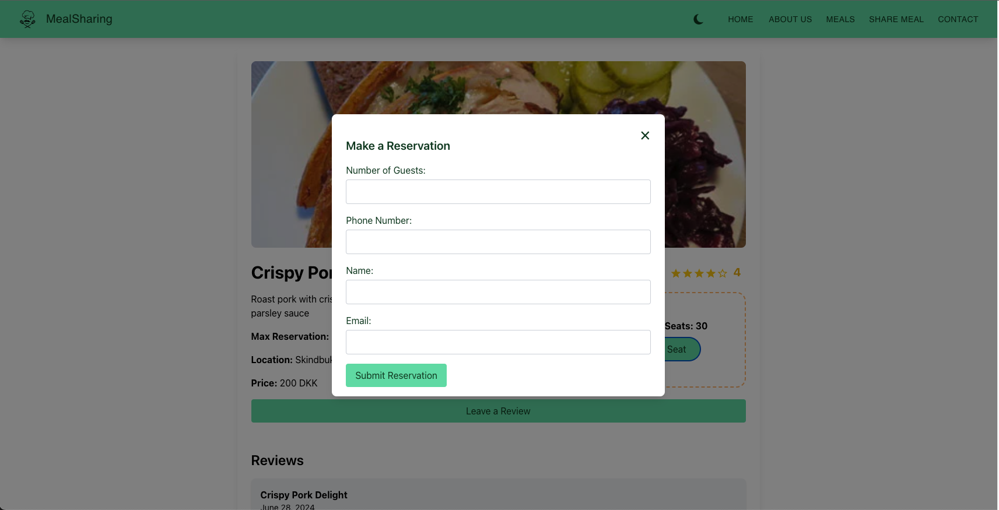
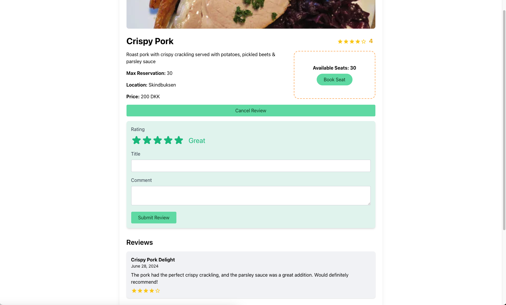
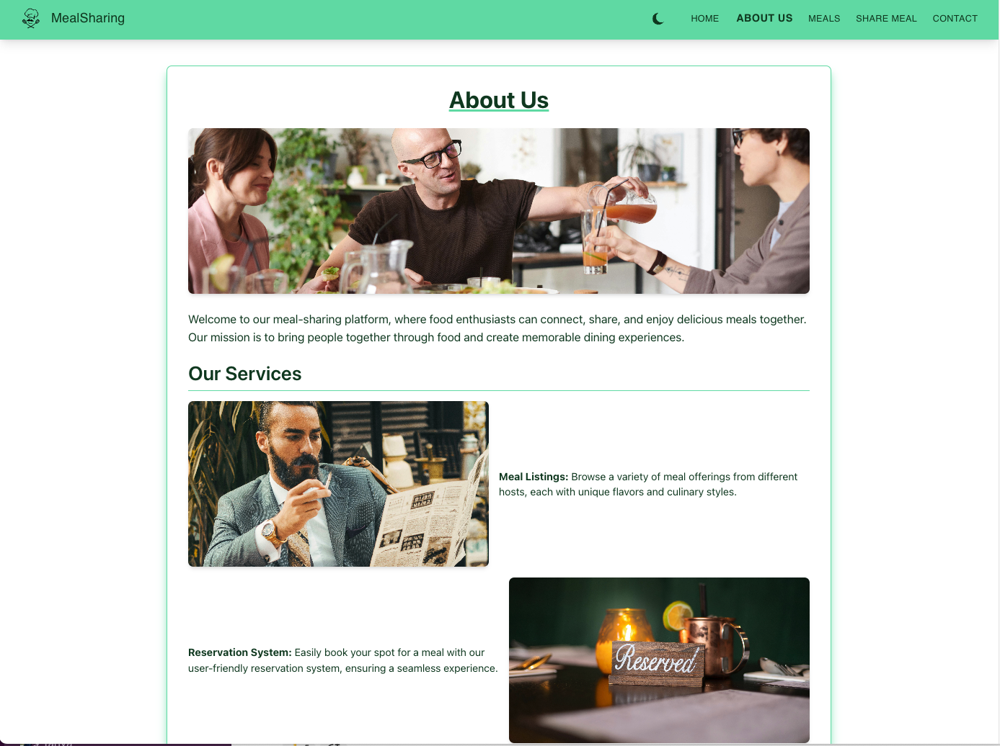
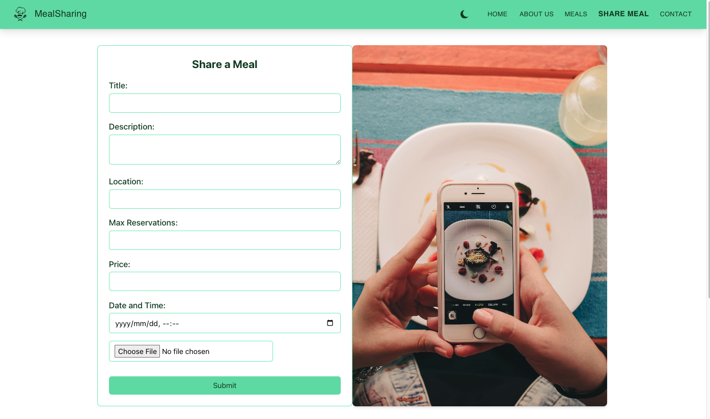
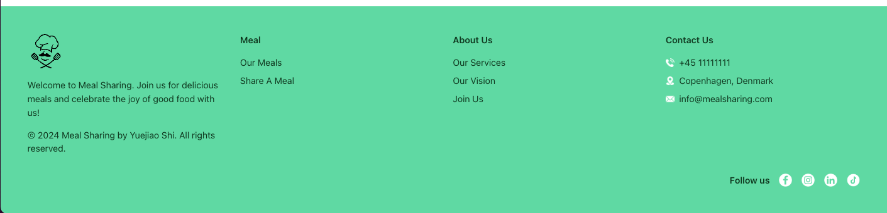

# MealSharing

MealSharing is a dynamic web application designed for food enthusiasts to explore, manage, and share meals with others. Leveraging a RESTful API built with Node.js and Express, this app allows users to curate their meal experiences, make reservations, and leave reviews. Developed as a personal project, MealSharing showcases essential web development principles and best practices in API design.

## Live Demo

[](https://meal-sharing-yjs.vercel.app/) [MealSharing](https://meal-sharing-yjs.vercel.app/)

## Technologies and Techniques Used

[](https://nodejs.org/) JavaScript runtime for building the API.  
[](https://expressjs.com/) Web framework for creating the RESTful API.  
[](https://nextjs.org/) Framework for building the frontend application with React.  
[](https://www.mysql.com/) Database management system used during development for database design.  
[](https://www.postgresql.org/) Advanced database management system used during deployment.  
[](https://tailwindcss.com/) Utility-first CSS framework for styling the application.  
[](https://www.pgadmin.org/) Database management tool for handling PostgreSQL databases.  
[](https://render.com/) Platform for deploying the backend API.  
[](https://vercel.com/) Platform for deploying the frontend application.

## Visual Overview

### Home page light mode

[](./previewImgs/home-light.png)

### Home page dark mode

[](./previewImgs/home-dark.png)

### Meal List page

[](./previewImgs/meals.png)

### Meal Details page

[](./previewImgs/meal-details.png)

### Meal Reservation Modal

[](./previewImgs/reservation-modal.png)

### Leave Review

[](./previewImgs/leave-review.png)

### About Us page

[](./previewImgs/about-us.png)

### Share Meal page

[](./previewImgs/share-meal.png)

### Footer

[](./previewImgs/footer.png)

## Features

- **Browse Meals**: Discover a wide variety of meals available in the app.
- **View Meal Details**: Access detailed information about selected meals, including ingredients and preparation instructions.
- **Make Reservations**: Reserve meals for specific dates and times.
- **Leave Reviews**: Share your experiences and rate meals to help others in the community.
- **Search Functionality**: Find meals by entering keywords related to the meal name or type.

## Components and Hooks

### Components

- **`App`**: The main component integrating all features and UI elements.
- **`MealsPage`**: Displays a list of meals, including search and filtering functionality.
- **`MealByID`**: Shows detailed information about a selected meal, including reviews and reservation options.
- **`MealsList`**: Renders a list of meals based on the fetched data.
- **`SearchBar`**: Provides an input field for searching meals.
- **`FilterControls`**: Allows users to sort and filter meals based on specific criteria.
- **`ReservationModal`**: A modal for handling meal reservations.
- **`LeaveReview`**: A component for users to submit reviews for meals.
- **`StarRating`**: A component for displaying and handling star ratings.
- **Filter Meals**: Easily filter meals based on different criteria, such as meal type, dietary preferences, or ratings.

## Getting started

> Before you start, make sure no other projects are running, in order to have the ports free.

To get started you'll need two terminals.

In the first terminal run the following commands:

```
cd api
cp .env-example .env
npm install
npm run dev
```

You can then test the API using [Postman](https://www.postman.com/) at [http://localhost:3001/api](http://localhost:3001/api).

In the second terminal run the following commands:

```
cd app
npm install
npm run dev
```

You can then open the web app at [http://localhost:3000](http://localhost:3000).
