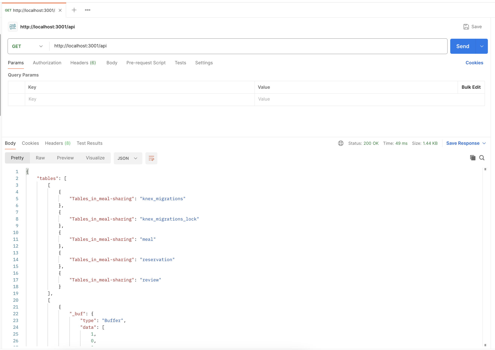

## Visual Overview

### Home page light mode

[](./previewImgs/home-light.png)

### Home page dark mode

[](./previewImgs/home-dark.png)

### Meal page 

[](./previewImgs/meals.png)

### About Us page

[](./previewImgs/about-us.png)

### Share Meal page

[](./previewImgs/share-meal.png)

### Footer

[](./previewImgs/footer.png)

## Getting started

> Before you start, make sure no other projects are running, in order to have the ports free.

To get started you'll need two terminals.

In the first terminal run the following commands:

```
cd api
cp .env-example .env
npm install
npm run dev
```

You can then test the API using [Postman](https://www.postman.com/) at [http://localhost:3001/api](http://localhost:3001/api).


In the second terminal run the following commands:

```
cd app
npm install
npm run dev
```

You can then open the web app at [http://localhost:3000](http://localhost:3000).
